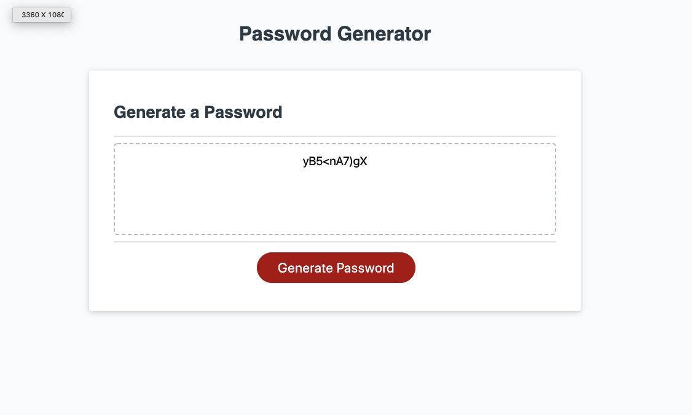

Deployed live website:  https://jguerra21.github.io/password-generator/homework-3/index.html

# password-generator
For this homework I am using JavaScript to generate a password based on user criteria. My goal is to create a functional password generator for users to be able to generate a new password that is required to have, Lowercase, Uppercase, Numbers and Numeric numbers.
I have used all the steps given to me on a ReadMe file in order to follow the steps in order and complete the final work. 

Given user need a new, secure password
When user clicks the button to generate a password
Then ser are presented with a series of prompts for password criteria

When user are prompted for password criteria
Then user will select which criteria to include in the password

When user are prompted for the length of the password
Then user will choose a length of at least 8 characters and no more than 128 characters

When user are prompted for character types to include in the password
Then user will choose at least one lowercase, one uppercase, one numeric, and/or one special character

Whem user answer each prompt
Then their input should be validated and at least one character type should be selected
When all prompts are answered

Then a password is generated that matches the selected criteria
When the password is generated
Then the password is either displayed in an alert or written to the page

Password generator is completed and ready for user to use it. Below is a screenshot of final completed password generator.

